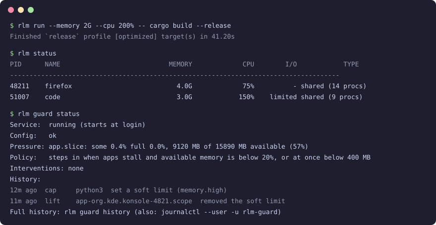

# rlm

rlm sets memory, CPU and I/O limits on your own Linux processes without root, from a CLI or a GTK app, and can run a small guard that freezes or caps a runaway app under memory pressure instead of killing it.



## What it does today

**Limits.** rlm uses cgroup v2 under systemd user delegation, so it needs no root for your own processes.

- `rlm run` starts a command inside a new limited cgroup.
- `rlm limit` limits processes that are already running, by PID, by name, by application (one shared pool) or by a list of PIDs.
- `rlm unlimit` removes limits.
- Profiles are named sets of limits: four built-in presets plus your own in `~/.config/rlm/config.yaml`.
- Persistent rules (`rlm limit --application <exe> ... --save`) are applied by rlm-guard to running and future instances of an app.

**The guard (rlm-guard).** This is an optional per-user service.

- It acts only on your own apps under systemd's `app.slice` and on the cgroups rlm itself created.
- It acts only while apps are stalling on memory (PSI) and available memory is below 20% of RAM or below 400 MB.
- It freezes the app for 5 seconds, then applies a soft `memory.high` cap if pressure stays high.
- It lifts every freeze and cap after 30 seconds of calm.
- It never sends a signal to any process.
- It holds at most 3 apps at a time.

### Not yet

- Protecting the desktop session's own memory (a `memory.min` chain for the session).
- Event-driven PSI triggers. The guard samples once per second.
- Notifications with Resume or Keep paused actions. Today the guard can send a plain `notify-send` warning when pressure rises.
- A system-wide mode for other users or system services.

### What it is not

- Not a replacement for systemd-oomd or earlyoom. Those kill processes; rlm pauses and slows them. You can run both.
- It has no effect on processes of other users or of root.

## Supported distros

Any Linux with cgroup v2, PSI and systemd:

| Distro              | Version |
|---------------------|---------|
| Ubuntu              | 22.04+  |
| Debian              | 12+     |
| Fedora              | 31+     |
| RHEL / Rocky / Alma | 9+      |
| Arch                | current |
| openSUSE Tumbleweed | current |

Older versions may work with the `systemd.unified_cgroup_hierarchy=1` kernel boot parameter.

## Install

### From packages

Download from [Releases](https://github.com/jayashankarvr/rlm/releases) (packages are available from 0.2.0 on):

```bash
# Debian/Ubuntu
sudo apt install ./rlm_*.deb ./rlm-gtk_*.deb

# Fedora/RHEL
sudo dnf install ./rlm-*.rpm ./rlm-gtk-*.rpm
```

The `rlm` package ships `rlm`, `rlm-guard`, a systemd user unit for the guard and the delegation drop-in `rlm-delegate.conf`. `rlm-gtk` is the GUI.

### Arch Linux (AUR)

The AUR packages are `rlm` and `rlm-gtk`:

```bash
yay -S rlm rlm-gtk
```

### crates.io

```bash
cargo install rlmctl
```

This installs `rlm` and `rlm-guard`. The GUI is not on crates.io because it needs the GTK4 and libadwaita development headers to build; install it from source.

### From source

```bash
cargo install --path cli        # rlm and rlm-guard
cargo install --path gtk-gui    # rlm-gtk (needs GTK4 and libadwaita headers)
./install-desktop.sh            # desktop entry and icon
```

### After installing

1. Enable cgroup delegation. The packages do this for you. For crates.io and source installs:

   ```bash
   sudo mkdir -p /etc/systemd/system/user@.service.d
   printf '[Service]\nDelegate=cpu memory io\n' | sudo tee /etc/systemd/system/user@.service.d/rlm-delegate.conf
   sudo systemctl daemon-reload
   ```

2. Log out and back in.
3. Run `rlm doctor`. It checks cgroup v2, delegated controllers, PSI, your config file and the guard binary, unit and service.
4. Optional: run `rlm guard enable`. When no packaged unit exists (crates.io and source installs), it writes `~/.config/systemd/user/rlm-guard.service` pointing at your `rlm-guard`, then enables and starts it with `systemctl --user`.

After you upgrade the binary, restart the guard so the new version runs:

```bash
systemctl --user restart rlm-guard
```

## CLI usage

### Limit a running process

```bash
# By PID (individual limit)
rlm limit --pid 1234 --memory 512M --cpu 50%

# By name (limits all matching processes individually)
rlm limit --name firefox --memory 2G

# By application (all processes share one limit pool)
rlm limit --application firefox --memory 4G --cpu 75%

# Several PIDs sharing one pool
rlm limit --all-pids 1234,5678,9012 --memory 2G --cpu 50%

# With I/O limits
rlm limit --pid 1234 --memory 1G --io-read 50M --io-write 20M

# Preview without applying
rlm limit --pid 1234 --memory 512M --dry-run
```

With `--application` or `--all-pids`, the processes share the limits: 10 processes with a 4G limit get 4G in total, not 4G each. See [APPLICATION_LIMITING.md](APPLICATION_LIMITING.md).

- Sizes use binary units and accept decimals and `B`/`iB` suffixes: `512M`, `1.5G`, `2GiB`, `512MB` are all valid. Memory limits below 8M and I/O limits below 64K/s are rejected.
- CPU is a percentage of one core: `50%` is half a core, `200%` is two cores.
- Batch operations (`--name`, `--application`, `--all-pids`) ask for confirmation. Pass `--yes` to skip it; `--yes` is required when stdin is not a terminal, for example in scripts.
- Processes on the guard protect list (desktop session, shells, audio) are refused unless you pass `--force`.
- Processes owned by other users are always refused (unless you run rlm as root). `--force` does not change that.

### Persistent rules

```bash
rlm limit --application firefox --memory 4G --save   # limit now and keep the rule
rlm rule list
rlm rule remove firefox
```

A saved rule is applied by rlm-guard, so the guard service must be running for it to cover future instances. `rlm unlimit --application firefox` drops the live limit but keeps the rule; add `--forget` to delete the rule too.

### Run a command with limits

```bash
rlm run --memory 1G --cpu 100% -- ./my-program arg1 arg2

# Using a profile (names are case-insensitive); explicit flags override the profile
rlm run --profile browser -- firefox
rlm run --profile browser --memory 6G -- firefox
```

### Remove limits

```bash
rlm unlimit --pid 1234
rlm unlimit --name firefox
rlm unlimit --application firefox  # shared application limit
rlm unlimit --cgroup app-firefox   # by cgroup name
```

`rlm unlimit` says so when there was nothing to remove. A released process can be limited again.

### Other commands

```bash
rlm status                           # managed processes and their limits (read-only)
rlm profiles                         # built-in presets and your profiles
rlm doctor                           # diagnose setup problems
rlm export profiles.yaml             # export your profiles
rlm import profiles.yaml             # import profiles
rlm import profiles.yaml --overwrite # replace profiles with the same name
```

## How limits behave

- `--memory` sets `memory.max`, plus `memory.high` at 90% of it so reclaim starts before the hard limit, and `memory.swap.max=0` so the limited app cannot spill into swap. The limit is a real RAM ceiling.
- Memory a process allocated before you limited it stays charged to its previous cgroup. Only new allocations count against the limit. To cap an app's whole footprint, start it with `rlm run`.
- `rlm run` keeps limits applied to everything the command started. If a launcher forks and exits, its children stay limited in the `run-*` cgroup and rlm prints the cgroup name. `rlm status` lists that cgroup, and `rlm unlimit --cgroup <name>` removes it.
- `rlm run` exits with the command's exit code, or with 128+N if signal N killed it (137 for SIGKILL). When the memory limit caused the kernel to kill a process, rlm says so.

## GUI

Launch with `rlm-gtk`. Pages:

- **Managed Processes**: what rlm is limiting now
- **Limit Running**: limit running processes, grouped by application
- **Launch New**: start a command with limits
- **Profiles**: create, edit and delete profiles
- **Guard**: service state, pressure, active interventions and history
- **About**: version and license

Ctrl+1 to Ctrl+6 switch pages. Ctrl+Q quits. The GUI hides processes on the protect list; use the CLI with `--force` if you really need to limit one.

## Freeze guard

```bash
rlm guard enable    # install the user unit if needed, enable and start the service
rlm guard status    # service state, config, pressure, active interventions, recent history
rlm guard test      # dry run: what it would do right now, without acting
rlm guard history   # recent freezes, thaws, caps, lifts and failures
rlm guard disable   # stop and disable the service
```

Configure it under `guard:` in `~/.config/rlm/config.yaml`. Every key is optional; these are the defaults:

```yaml
guard:
  enabled: true
  trigger:
    psi_some_warn: 10
    psi_some_high: 30
    psi_full_critical: 10
    mem_available_floor_mb: 400
    act_below_available_pct: 20
  timing:
    freeze_hold_secs: 5
    calm_hold_secs: 30
    freeze_cooldown_secs: 60
    sample_interval_ms: 1000
  selection:
    min_rss_mb: 200
    protect: []   # names here are added to the built-in protect list
  notify: true
```

- `enabled: false` turns off freezing and capping; rlm-guard still applies persistent rules.
- `notify` sends a plain `notify-send` warning when pressure rises.
- Unknown keys and out-of-range values are errors. With an invalid config, rlm-guard exits with status 78 and stays stopped until you fix the file, then run `systemctl --user restart rlm-guard`. `rlm guard status` shows the error.

### How the guard stays safe

**Can it kill my app?**
No. It only freezes the app's cgroup (through systemd, with a direct `cgroup.freeze` write as fallback) or sets `memory.high`. It never sends a signal. The kernel's own OOM killer is not affected, so a hard memory limit you set can still end in an OOM kill.

**What if the guard crashes while an app is frozen?**
Every freeze and cap is written to a journal, `~/.local/state/rlm/guard-journal.jsonl`, before it is applied. On the next start, including a start that fails on a bad config, the guard replays the journal and restores the app. Entries are keyed by boot and cgroup identity, so it never touches a cgroup that was since recreated for something else. On a normal stop (SIGTERM) it undoes everything before exiting.

**Could it freeze my desktop or terminal?**
Processes on the protect list are never acted on: desktop shells and compositors, Xorg and Xwayland, sshd, systemd, dbus-daemon, the audio stack, bash, zsh, fish and rlm-guard. A scope that contains a protected process, such as a terminal whose shell shares the scope with a runaway script, is capped and never frozen. Add your own names under `guard.selection.protect`.

**Why did it not act when my machine was slow?**
It needs both conditions: apps under `app.slice` stalling on memory, and available memory below 20% of RAM or below 400 MB. Slowness from CPU or disk load does not count. A stall inside one cgroup that rlm limited is ignored by design: that app is hitting the limit you set, and the rest of the system is fine.

**How hard is a cap?**
Soft. A cap never goes below 90% of the app's current memory or below 256 MiB. On hosts without swap it never asks for more than the app's file cache can give back. The app slows down while the kernel reclaims; it is not killed. A cap never loosens a lower `memory.high` that was already in place.

### Seeing what the guard did

- `rlm guard status`: current state and the last few events
- `rlm guard history`: the recorded history (`~/.local/state/rlm/guard-history.jsonl`)
- The GUI Guard page
- `journalctl --user -u rlm-guard` for the full log

## Configuration

Create `~/.config/rlm/config.yaml`:

```yaml
profiles:
  browser:
    memory: "4G"
    cpu: "200%"
  dev:
    memory: "8G"
    cpu: "400%"
    io_read: "100M"
    io_write: "50M"
```

A system-wide file at `/etc/rlm/config.yaml` is read first; your file overrides it.

### Built-in presets

| Preset  | Memory | CPU  | I/O read/write |
|---------|--------|------|----------------|
| Light   | 512M   | 25%  | -              |
| Medium  | 2G     | 50%  | 50M/25M        |
| Heavy   | 4G     | 100% | 100M/50M       |
| Browser | 4G     | 75%  | -              |

Profile names are case-insensitive: `rlm run --profile medium -- ./command`.

## Cgroup delegation (non-root usage)

rlm writes to cgroups your systemd user manager owns, so the memory, cpu and io controllers must be delegated to it. The .deb, .rpm and AUR packages install the drop-in `rlm-delegate.conf`; log out and back in after installing.

For crates.io and source installs:

```bash
sudo mkdir -p /etc/systemd/system/user@.service.d
printf '[Service]\nDelegate=cpu memory io\n' | sudo tee /etc/systemd/system/user@.service.d/rlm-delegate.conf
sudo systemctl daemon-reload
```

Then log out and back in, and run `rlm doctor` to verify.

## License

Apache 2.0
